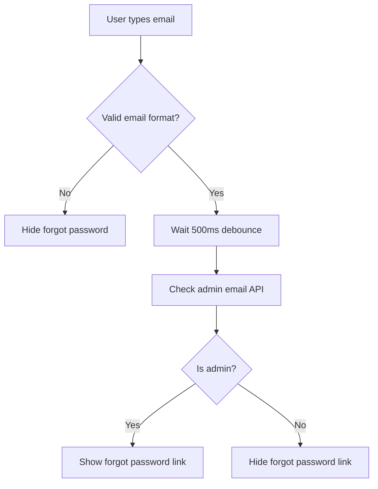

# Email-Based Login System Guide

This guide explains the updated login system that uses email addresses instead of usernames and shows the "Forgot Password" option only for admin users.

## 🔄 What Changed

### Backend Changes
1. **Login endpoint** now accepts `email` instead of `username`
2. **New endpoint** `/api/auth/check-admin-email` to check if an email belongs to an admin
3. **Password change endpoint** updated to use email
4. **All authentication** now based on email addresses

### Frontend Changes
1. **Login form** uses email field instead of username
2. **Dynamic forgot password link** - only shows for admin emails
3. **Real-time email checking** with debounced API calls
4. **Improved user experience** with smart form behavior

## 🚀 How It Works

### 1. Email-Based Authentication
```javascript
// Old login request
{
  "username": "admin",
  "password": "password123"
}

// New login request
{
  "email": "admin@pharmacy.com",
  "password": "password123"
}
```

### 2. Smart Forgot Password Display
- User types email address
- System checks if email belongs to admin (with 500ms debounce)
- "Forgot Password" link appears only for admin emails
- No performance impact with efficient debouncing

### 3. Admin Detection Flow


## 🔧 API Endpoints

### Check Admin Email
```http
POST /api/auth/check-admin-email
Content-Type: application/json

{
  "email": "user@pharmacy.com"
}
```

**Response:**
```json
{
  "isAdmin": false
}
```

### Email-Based Login
```http
POST /api/auth/login
Content-Type: application/json

{
  "email": "admin@pharmacy.com",
  "password": "SecurePassword123!"
}
```

**Response:**
```json
{
  "message": "Login successful",
  "user": {
    "id": "user_id",
    "username": "admin",
    "email": "admin@pharmacy.com",
    "role": "admin"
  },
  "token": "simple-auth-token",
  "role": "admin"
}
```

### Email-Based Password Change
```http
POST /api/auth/change-password
Content-Type: application/json

{
  "email": "admin@pharmacy.com",
  "currentPassword": "oldPassword",
  "newPassword": "NewSecurePassword123!"
}
```

## 🎨 Frontend Features

### Smart Form Behavior
- **Email validation**: Real-time email format checking
- **Admin detection**: Automatic admin email detection
- **Debounced API calls**: Prevents excessive server requests
- **Clean UI**: Forgot password link appears smoothly
- **Memory cleanup**: Proper timeout cleanup on component unmount

### User Experience
1. User starts typing email
2. System validates email format
3. After 500ms of no typing, checks if admin
4. Forgot password link appears/disappears smoothly
5. No unnecessary API calls or UI flicker

## 🔒 Security Features

### Email Privacy
- Admin check endpoint doesn't reveal if email exists
- Returns `isAdmin: false` for non-existent emails
- Prevents email enumeration attacks

### Performance Optimization
- 500ms debounce prevents API spam
- Efficient email format pre-validation
- Cleanup prevents memory leaks

### Role-Based Access
- Forgot password only for admins
- Maintains security boundaries
- Clear separation of user types

## 🧪 Testing

### Manual Testing
1. **Start the servers:**
   ```bash
   # Backend
   cd backend
   npm start

   # Frontend
   cd last
   npm start
   ```

2. **Test admin email:**
   - Go to login page
   - Type an admin email address
   - See "Forgot Password" link appear

3. **Test non-admin email:**
   - Type a regular user/salesman email
   - "Forgot Password" link should not appear

4. **Test login:**
   - Use email instead of username
   - Login should work for both admin and salesman

### Automated Testing
```bash
cd backend
node test-email-login.js
```

## 📱 User Roles Supported

### Admin Users
- ✅ Email-based login
- ✅ Forgot password option
- ✅ Full system access
- ✅ Password reset via email

### Salesman/User
- ✅ Email-based login
- ❌ No forgot password option
- ✅ Regular system access
- ❌ Must contact admin for password reset

## 🔧 Configuration

### Database Setup
Ensure your users have valid email addresses:
```javascript
// Example user documents
{
  "username": "admin",
  "email": "admin@pharmacy.com",
  "role": "admin",
  "password": "hashed_password"
}

{
  "username": "salesman1",
  "email": "salesman1@pharmacy.com", 
  "role": "user",
  "password": "hashed_password"
}
```

### Environment Variables
```env
# Email configuration (for forgot password)
EMAIL_USER=your-admin-email@gmail.com
EMAIL_PASS=your-gmail-app-password
FRONTEND_URL=http://localhost:3000
```

## 🚨 Migration Notes

### For Existing Users
- All existing users can now login with their email addresses
- Username field is no longer used for authentication
- Usernames are still stored and displayed in the system
- No data migration required

### For Developers
- Update any hardcoded login requests to use `email` instead of `username`
- Update forms and components that reference username for login
- Test all authentication flows with email addresses

## 🎯 Benefits

### User Experience
- ✅ More intuitive (people remember emails better)
- ✅ Consistent with modern web applications
- ✅ Smart forgot password for admins only
- ✅ Reduced cognitive load

### Security
- ✅ Email-based password recovery
- ✅ Role-based forgot password access
- ✅ Prevents unauthorized password resets
- ✅ Maintains user privacy

### Maintenance
- ✅ Easier user identification
- ✅ Consistent with email notifications
- ✅ Better audit trails
- ✅ Simplified user management

The email-based login system is now fully functional and provides a better, more secure user experience! 🎉